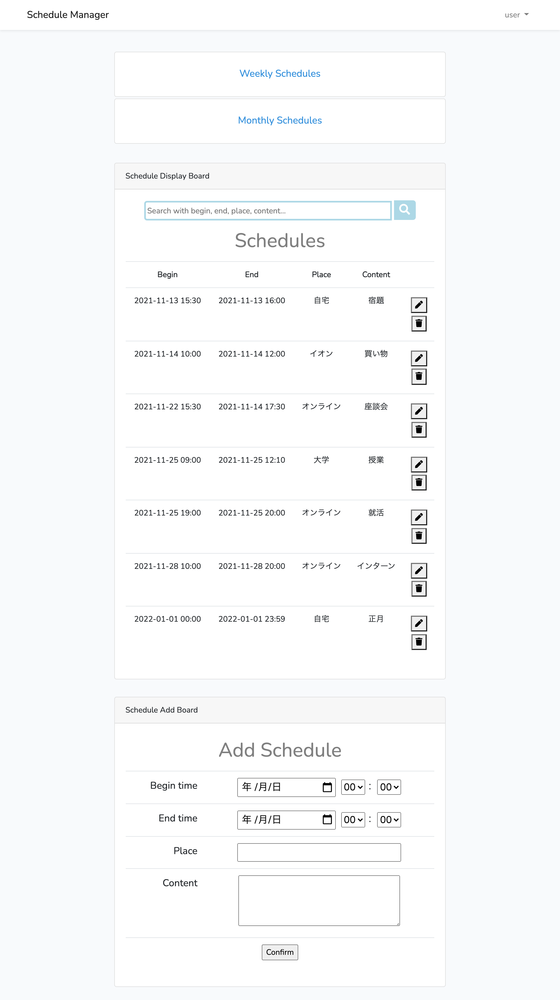
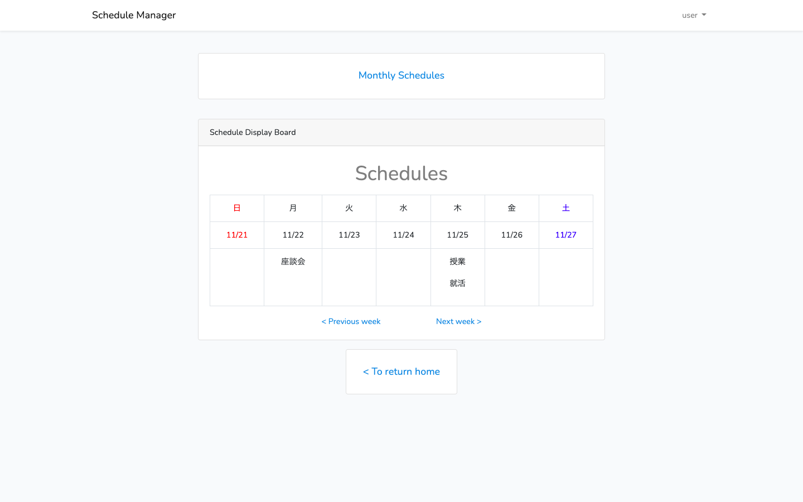
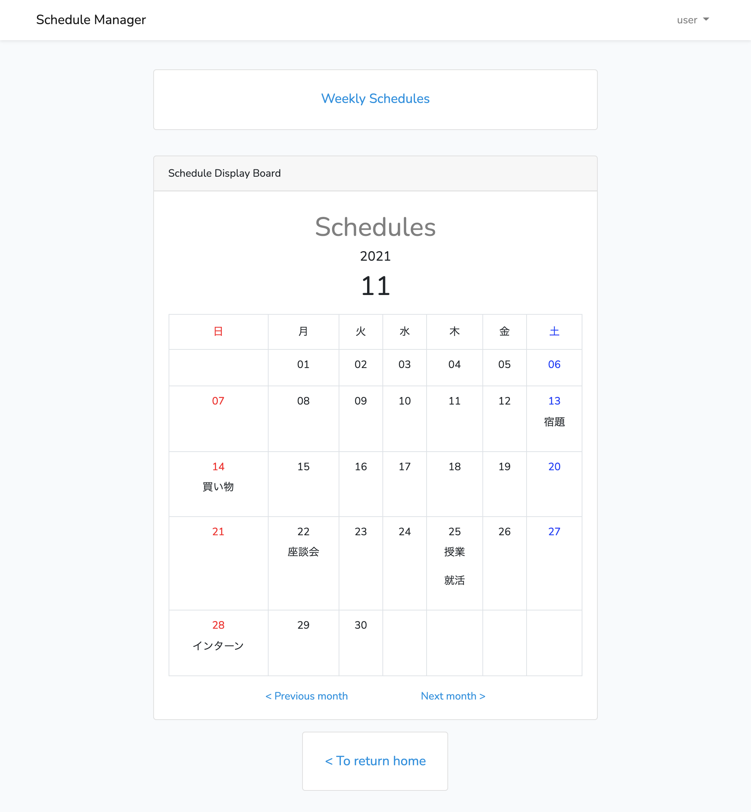
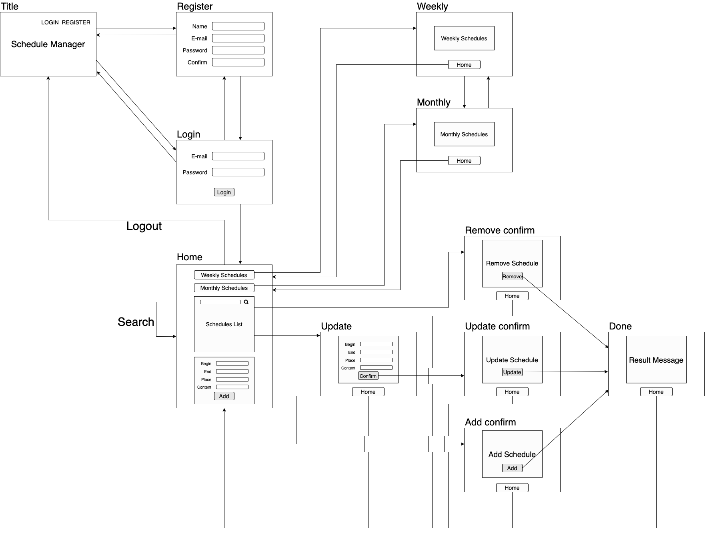

# Schedule Manager
[Laravel](http://laravel.jp/)を利用したスケジュール管理Webアプリ

## DEMO

## Features

週間・月間のスケジュール表示に対応

- 週間スケジュール表示
  

- 月間スケジュール表示
  

## Requirement

| Framework | Version |
| --- | --- |
| Laravel | 6.20.38 |

## Note

画面構成は以下の通り

## Author

- [Lium1126](https://github.com/Lium1126)
- Aichi Institute of Technology

## License

The Laravel framework is open-sourced software licensed under the [MIT license](https://github.com/laravel/framework/blob/8.x/LICENSE.md).
